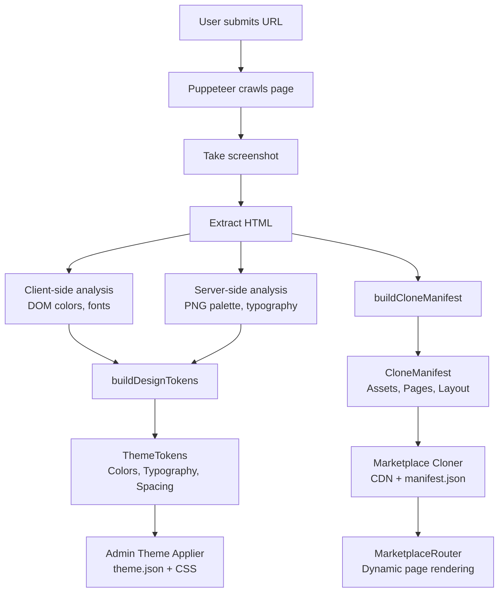

# 🎨 Brand Scanner 2.1 PRO - Complete Guide

> **Diamond Edition** - Advanced brand identity extraction and marketplace cloning system with CIELAB color science, typography analysis, and dynamic theming.

---

## 📋 Table of Contents

- [Overview](#overview)
- [Architecture](#architecture)
- [Extract Mode](#extract-mode)
- [Clone Mode](#clone-mode)
- [Dynamic Theming](#dynamic-theming)
- [Marketplace Router](#marketplace-router)
- [API Reference](#api-reference)
- [Security](#security)
- [Troubleshooting](#troubleshooting)

---

## Overview

Brand Scanner 2.1 PRO is a sophisticated brand identity extraction and cloning system that combines:

1. **CIELAB Color Science** - Perceptually accurate color extraction using CIE color spaces
2. **Typography Analysis** - Automatic font detection and @font-face parsing
3. **Design Tokens** - Complete theme token generation for seamless integration
4. **Marketplace Cloning** - Asset publishing and dynamic page rendering
5. **Admin Theming** - Apply extracted brands to admin interface

### Key Capabilities

- ✅ **100% TypeScript** - Fully typed with comprehensive interfaces
- ✅ **Error Isolation** - Independent try-catch blocks for graceful degradation
- ✅ **Security Hardened** - SSRF protection, path traversal prevention, script sanitization
- ✅ **Production Ready** - Transactional writes, atomic operations, idempotency
- ✅ **Extensible** - Modular architecture with clear separation of concerns

---

## Architecture

### Module Structure

```
server/
├── brandScanner.ts          # Main orchestrator, Puppeteer integration
├── color.ts                 # CIELAB color science (sRGB↔XYZ↔LAB, K-Means, ΔE)
├── brandScannerTheme.ts     # Palette + typography extraction, token generation
├── brandCloneManifest.ts    # Layout heuristics, manifest creation
├── adminThemeApplier.ts     # Theme.json + CSS generation
└── marketplaceCloner.ts     # CDN publishing, manifest writing

client/
├── types/brandScanner.ts    # Shared TypeScript types
├── hooks/useTokens.ts       # TanStack Query hooks (useTokens, useManifest)
├── components/marketplace/  # Dynamic marketplace components
│   ├── Nav.tsx
│   ├── Hero.tsx
│   ├── Section.tsx
│   ├── Gallery.tsx
│   ├── Footer.tsx
│   └── BuyButton.tsx
└── pages/MarketplaceRouter.tsx  # Dynamic routing with lazy-load

.storage/
└── public/
    └── marketplace/
        ├── assets/          # Published CDN assets (images, videos, SVGs)
        └── manifest.json    # Complete marketplace manifest
```

### Data Flow



---

## Extract Mode

### CIELAB Color Science

**File**: `server/color.ts`

#### Color Space Conversions

Brand Scanner uses perceptually accurate color spaces for analysis:

```typescript
// sRGB → XYZ → LAB conversion pipeline
const srgb = { r: 0.8, g: 0.4, b: 0.2 };  // Normalized [0-1]
const xyz = srgbToXyz(srgb);              // CIE XYZ (D65 illuminant)
const lab = xyzToLab(xyz);                // CIE LAB (perceptual)
```

**Why CIELAB?**
- **Perceptual Uniformity**: ΔE distance correlates with human perception
- **Device Independent**: Works across different displays and color profiles
- **Better Clustering**: K-Means performs better in perceptual space

#### Gamma Correction

sRGB uses non-linear encoding (gamma ~2.2):

```typescript
// Decode sRGB to linear
if (channel <= 0.04045) {
  linear = channel / 12.92;
} else {
  linear = Math.pow((channel + 0.055) / 1.055, 2.4);
}
```

#### K-Means Clustering

Extracts dominant colors with mathematical safeguards:

```typescript
const palette = kMeansClustering(labPixels, k, maxIterations);

// Guards applied:
// - Clamping: Ensures values stay in valid ranges
// - Rounding: Prevents floating-point drift
// - Max iterations: Prevents infinite loops
// - Convergence check: Stops when stable
```

#### Color Distance (ΔE)

```typescript
const deltaE = colorDistance(lab1, lab2);
// ΔE < 1.0: Not perceptible to human eyes
// ΔE 1-2: Perceptible through close observation
// ΔE 2-10: Perceptible at a glance
// ΔE > 10: Colors are more different than similar
```

### Typography Extraction

**File**: `server/brandScannerTheme.ts` → `extractTypographyFromHtml()`

#### Font Family Detection

Analyzes computed styles from DOM elements:

```typescript
const families = new Map<string, Set<number>>();

// Iterate all elements
for (const el of document.querySelectorAll('*')) {
  const computed = window.getComputedStyle(el);
  const family = computed.fontFamily;
  const weight = parseInt(computed.fontWeight);
  
  // Track unique family → weights
  families.get(family).add(weight);
}
```

#### @font-face Parsing

Extracts font sources from stylesheets:

```typescript
// Inline styles
const styleEls = document.querySelectorAll('style');

// External stylesheets
const linkEls = document.querySelectorAll('link[rel="stylesheet"]');

// Parse @font-face rules
const fontFaceRegex = /@font-face\s*\{([^}]+)\}/g;
const familyMatch = /font-family\s*:\s*["']?([^"';]+)/;
const srcMatch = /src\s*:\s*([^;]+)/;
```

**Bounds Checks**:
- String length validation (`family.length > 0 && family.length < 100`)
- Weight validation (`weight >= 100 && weight <= 900`)
- Duplicate prevention

### Design Tokens Generation

**File**: `server/brandScannerTheme.ts` → `buildDesignTokens()`

Combines client-side + server-side analysis into complete ThemeTokens:

```typescript
interface ThemeTokens {
  // Colors (HSL format for CSS variables)
  primary: ColorToken;
  secondary: ColorToken;
  accent: ColorToken;
  background: ColorToken;
  foreground: ColorToken;
  // ... more colors
  
  // Typography
  fontPrimary: TypographyToken;
  fontSecondary: TypographyToken;
  fontMono: TypographyToken;
  
  // Spacing & Layout
  borderRadius: string;
  spacing: { xs: string; sm: string; md: string; lg: string; xl: string };
  
  // Metadata
  sourceUrl: string;
  generatedAt: string;
}
```

**Fallback Strategy**:
```typescript
// If server-side enrichment fails, use client-side data
const palette = advancedPalette?.colors || clientColors.map(hex => ({ hex, ... }));
const typography = advancedTypography?.families || clientFonts.map(family => ({ ... }));
```

---

## Clone Mode

### Asset Management

**File**: `server/brandCloneManifest.ts` → `buildCloneManifest()`

#### SHA256 Deduplication

```typescript
const hash = crypto.createHash('sha256').update(buffer).digest('hex');
const existingAsset = assetMap.get(hash);

if (existingAsset) {
  // Reuse existing asset, skip download
  return existingAsset;
}
```

**Benefits**:
- Eliminates duplicate downloads
- Reduces storage costs
- Faster manifest generation

#### Asset Type Classification

```typescript
function classifyAsset(url: string): AssetType {
  const ext = path.extname(url).toLowerCase();
  
  if (['.jpg', '.jpeg', '.png', '.gif', '.webp'].includes(ext)) return 'image';
  if (['.mp4', '.webm', '.ogg'].includes(ext)) return 'video';
  if (ext === '.svg') return 'svg';
  return 'other';
}
```

### Layout Heuristics

Automatically detects page structure:

```typescript
interface LayoutHint {
  kind: 'hero' | 'section' | 'gallery' | 'footer' | 'nav' | 'content';
  notes?: string;
}
```

**Detection Rules**:
- **Hero**: Large background image + h1 + CTA button in viewport
- **Gallery**: Grid of images (≥4) with similar aspect ratios
- **Nav**: Top fixed element with links
- **Footer**: Bottom element with columns
- **Section**: Repeating patterns with headers

### Manifest Structure

```json
{
  "siteUrl": "https://example.com",
  "tokens": { /* ThemeTokens */ },
  "assets": [
    {
      "localPath": ".storage/brand-scanner/job-123/assets/image.png",
      "originalUrl": "https://example.com/image.png",
      "type": "image",
      "hash": "abc123...",
      "bytes": 45678
    }
  ],
  "pages": [
    {
      "url": "https://example.com/",
      "route": "/",
      "layout": [
        { "kind": "hero", "notes": "Main landing hero" },
        { "kind": "section", "notes": "Features grid" },
        { "kind": "gallery" },
        { "kind": "footer" }
      ]
    }
  ],
  "notes": [
    "Responsive design with mobile breakpoints",
    "Primary CTA is 'Get Started' button"
  ]
}
```

---

## Dynamic Theming

### Admin Theme Applier

**File**: `server/adminThemeApplier.ts` → `applyAdminTheme()`

#### Transactional Writes

```typescript
// 1. Write to temporary files
const themeTempPath = `${STORAGE_DIR}/theme.tmp.json`;
const cssTempPath = `${STORAGE_DIR}/generated.tmp.css`;

await fs.writeFile(themeTempPath, JSON.stringify(themeData, null, 2));
await fs.writeFile(cssTempPath, cssContent);

// 2. Atomic rename (POSIX operation)
await fs.rename(themeTempPath, `${STORAGE_DIR}/theme.json`);
await fs.rename(cssTempPath, `${STORAGE_DIR}/generated.css`);
```

**Why?**
- Prevents partial writes on crash
- Ensures consistency
- No readers see incomplete data

#### CSS Variable Generation

```typescript
:root {
  --primary: ${tokens.primary.hsl};
  --secondary: ${tokens.secondary.hsl};
  --font-primary: ${tokens.fontPrimary.family}, ${tokens.fontPrimary.fallback};
  --border-radius: ${tokens.borderRadius};
}
```

### BrandThemeProvider

**File**: `client/src/contexts/BrandThemeProvider.tsx` (existing)

Operations:
- **Preview**: Load tokens without persisting
- **Activate**: Apply tokens and save to localStorage
- **Rollback**: Restore previous theme
- **Clear**: Remove custom theme

---

## Marketplace Router

### Architecture

**File**: `client/src/pages/MarketplaceRouter.tsx`

```tsx
<MarketplaceRouter>
  ├── <Nav tokens={manifest.tokens} items={navItems} />
  ├── <Switch>
  │   ├── <Route path="/"> <DynamicPage page={...} /> </Route>
  │   ├── <Route path="/about"> <DynamicPage page={...} /> </Route>
  │   └── <Route> <NotFound /> </Route>
  └── <Footer tokens={manifest.tokens} />
</MarketplaceRouter>
```

### Lazy Loading

```tsx
const { manifest, isLoading, error } = useManifest();
// queryKey: ["/manifest", "full"]
// staleTime: 5 minutes
// gcTime: 30 minutes
// Fetches /public/marketplace/manifest.json once, then caches
```

### Dynamic Page Rendering

```tsx
function DynamicPage({ page, manifest }: DynamicPageProps) {
  return (
    <main>
      {page.layout.map((hint, index) => (
        <LayoutComponent
          key={index}
          hint={hint}
          tokens={manifest.tokens}
          assets={manifest.assets}
        />
      ))}
    </main>
  );
}
```

### Layout Component Mapping

```tsx
switch (hint.kind) {
  case 'hero':
    return <Hero tokens={tokens} title={hint.notes} backgroundImage={...} />;
  case 'gallery':
    return <Gallery tokens={tokens} assets={assets} columns={3} />;
  case 'section':
    return <Section tokens={tokens} title={hint.notes}>{...}</Section>;
  // ... etc
}
```

---

## API Reference

### POST `/api/brand-scanner/apply-admin-theme`

Apply extracted theme to admin interface.

**Authentication**: Required (`isAuthenticated`)

**Request Body**:
```typescript
{
  tokens: ThemeTokens  // Complete theme tokens object
}
```

**Response**:
```json
{
  "themeFile": "./.storage/theme.json",
  "cssFile": "./.storage/generated.css"
}
```

**Example**:
```bash
curl -X POST https://your-domain.replit.app/api/brand-scanner/apply-admin-theme \
  -H "Content-Type: application/json" \
  -H "Cookie: connect.sid=..." \
  -d '{
    "tokens": {
      "primary": { "hex": "#10A37F", "hsl": "158 84% 35%", "name": "Primary Green" },
      ...
    }
  }'
```

---

### POST `/api/brand-scanner/clone-to-marketplace`

Publish assets to CDN and create marketplace manifest.

**Authentication**: Required (`isAuthenticated`)

**Request Body**:
```typescript
{
  manifest: {
    siteUrl: string;
    tokens: ThemeTokens;
    assets: CloneAsset[];
    pages: PageBlueprint[];
    notes: string[];
  }
}
```

**Response**:
```json
{
  "assetsPublished": 42,
  "manifestUrl": "/public/marketplace/manifest.json",
  "publishedAt": "2025-10-27T12:34:56.789Z"
}
```

**Example**:
```bash
curl -X POST https://your-domain.replit.app/api/brand-scanner/clone-to-marketplace \
  -H "Content-Type: application/json" \
  -H "Cookie: connect.sid=..." \
  -d @manifest.json
```

---

## Security

### SSRF Protection

**File**: `server/brandScanner.ts` → `validateUrl()`

```typescript
// 1. DNS Cache Bypass
const customDns = new dns.Resolver();
customDns.setServers(['1.1.1.1', '8.8.8.8']);

// 2. Private IP Blocking
const ip = await customDns.resolve4(hostname);
if (isPrivateIP(ip)) {
  throw new Error('Private IPs are blocked');
}

// 3. Redirect Validation
// Check final redirect target after following chains
```

**Blocked Ranges (RFC 1918)**:
- `10.0.0.0/8`
- `172.16.0.0/12`
- `192.168.0.0/16`
- `127.0.0.0/8` (localhost)

### Path Traversal Prevention

**File**: `server/marketplaceCloner.ts`

```typescript
const safePath = path.normalize(targetPath);
const relPath = path.relative(MARKETPLACE_DIR, safePath);

if (relPath.startsWith('..') || path.isAbsolute(relPath)) {
  throw new Error('Path traversal attempt detected');
}
```

### Script Sanitization

**File**: `server/brandScanner.ts` (Clone Mode)

```typescript
// Remove all <script> tags from static snapshots
const sanitized = html.replace(/<script\b[^<]*(?:(?!<\/script>)<[^<]*)*<\/script>/gi, '');
```

---

## Troubleshooting

### "Failed to extract palette from PNG"

**Cause**: @napi-rs/canvas not installed or incompatible platform

**Solution**:
```bash
npm install @napi-rs/canvas
```

If platform incompatibility, system falls back to client-side colors automatically.

---

### "Path traversal attempt detected"

**Cause**: Asset path contains `..` or absolute path

**Solution**: This is a security feature working correctly. Check your manifest for malformed paths.

---

### "Manifest does not contain theme tokens"

**Cause**: Tokens field is undefined in manifest.json

**Solution**: Ensure `/api/brand-scanner/clone-to-marketplace` receives complete manifest with tokens:
```typescript
if (!manifest.tokens) {
  throw new Error("tokens is required");
}
```

---

### Marketplace Router shows 404

**Cause**: manifest.json not published or incorrect URL

**Solution**:
1. Check file exists: `/public/marketplace/manifest.json`
2. Verify static serving configured in `server/routes.ts`:
```typescript
app.use("/public", express.static(`${STORAGE_DIR}/public`));
```

---

## Performance Optimization

### Caching Strategy

**TanStack Query**:
- `staleTime: 5 minutes` - Don't refetch if data is fresh
- `gcTime: 30 minutes` - Keep in cache for 30 min after unmount
- `refetchOnWindowFocus: false` - Prevent unnecessary refetches

**Express Static**:
```typescript
app.use("/public", express.static(publicPath, {
  maxAge: "1h",     // Browser cache for 1 hour
  etag: true,       // Enable ETags
  lastModified: true
}));
```

### Asset Optimization

- **SHA256 Deduplication**: Eliminates duplicate downloads
- **Lazy Loading**: `` for gallery images
- **Image Compression**: Consider adding Jimp compression before publishing
- **CDN**: Assets served from `/public` (can add real CDN later)

---

## Future Enhancements

- [ ] WebP conversion for PNG assets
- [ ] Responsive image generation (srcset)
- [ ] Video thumbnail extraction
- [ ] CSS minification for generated.css
- [ ] Source maps for debugging
- [ ] Automated A/B testing of themes
- [ ] Machine learning for better layout detection
- [ ] SVG optimization (SVGO)
- [ ] Real CDN integration (Cloudflare, AWS CloudFront)
- [ ] Version control for themes (git-like)

---

## Resources

- [CIE Color Spaces](https://en.wikipedia.org/wiki/CIELAB_color_space)
- [K-Means Clustering](https://en.wikipedia.org/wiki/K-means_clustering)
- [WCAG Contrast](https://www.w3.org/WAI/WCAG21/Understanding/contrast-minimum.html)
- [TanStack Query](https://tanstack.com/query/latest)
- [Puppeteer](https://pptr.dev/)

---

**Brand Scanner 2.1 PRO** - Built with ❤️ for EAAS Platform
